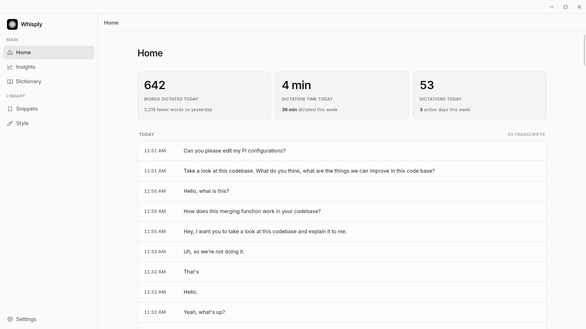

<p align="center">
  
</p>

<h1 align="center">Whisply</h1>

<p align="center">
  <a href="https://github.com/abboskhonov/whisply"></a>
</p>

<p align="center">
  <strong>Private, local-first voice dictation for Linux.</strong><br />
  Speak naturally, then keep writing in the app already in focus.
</p>

<p align="center">
  <a href="https://github.com/abboskhonov/whisply/releases">Download</a>
  ·
  <a href="#models">Models</a>
  ·
  <a href="#development">Development</a>
  ·
  <a href="#contributing">Contributing</a>
</p>

<p align="center">
  
  
  
</p>

---

Whisply is a desktop dictation app for people who want the speed of speaking without handing their voice to a transcription service. Pick a shortcut, talk, and Whisply transcribes your speech locally before placing the result into the app you are already using.

## What it does

- **Stays local** — speech recognition runs on your computer with a model you choose. Audio is not sent to a remote transcription API.
- **Writes where you work** — trigger dictation with a global shortcut and Whisply inserts the finished text into the focused app.
- **Fits your flow** — choose press-and-hold or tap-to-toggle dictation, then keep the selected model warm or unload it when you are done.
- **Works across Linux desktops** — the onboarding flow checks your microphone, shortcut, and text-insertion setup for the environment it finds.
- **Keeps a useful record** — review dictation history, inspect insights, and save reusable snippets that can be expanded with spoken commands.
- **Stays out of the way** — a small recording overlay and tray icon provide status without stealing your focus.

## Privacy, in plain language

Whisply downloads a speech model once, then performs recognition locally on the CPU through [sherpa-onnx](https://github.com/k2-fsa/sherpa-onnx). It needs a network connection to download models and fetch app updates—not to transcribe your voice.

Your selected-model settings and dictation history are stored in Whisply's local app data directory. Whisply does not claim to provide encryption or anonymity; protect your computer and its user account accordingly.

## Models

All bundled choices are open models. You choose one during onboarding and can switch later in **Settings → Models**.

| Model                                                                                | Best for                                        | Languages                               | Download | License   |
| ------------------------------------------------------------------------------------ | ----------------------------------------------- | --------------------------------------- | -------: | --------- |
| [Parakeet 0.6B Multilingual](https://huggingface.co/nvidia/parakeet-tdt-0.6b-v3)     | The default for high-quality everyday dictation | 25 European languages                   |  ~465 MB | CC BY 4.0 |
| [Parakeet 0.6B English](https://huggingface.co/nvidia/parakeet-tdt-0.6b-v2)          | Fast, accurate English-only dictation           | English                                 |  ~460 MB | CC BY 4.0 |
| [GigaAM Multilingual](https://huggingface.co/istupakov/gigaam-multilingual-ctc-onnx) | Uzbek, Kazakh, and Kyrgyz dictation             | Uzbek, Kazakh, Kyrgyz, Russian, English |  ~214 MB | MIT       |

Parakeet models are distributed as INT8 sherpa-onnx artifacts. GigaAM is used as an INT8 ONNX model. Model names, weights, and licenses belong to their respective authors; follow the linked model cards for their terms and attribution requirements.

## Download

Grab the newest Linux build from [GitHub Releases](https://github.com/abboskhonov/whisply/releases). Release builds include the formats produced by Tauri for Linux, including **AppImage**, **.deb**, and **.rpm** when available.

On first launch, Whisply opens a short setup window to help select a microphone, confirm input permissions, configure a shortcut, and download a model.

## Development

### Prerequisites

- Linux
- [Rust](https://rustup.rs/) (stable)
- [Bun](https://bun.sh/)
- Linux desktop build dependencies for WebKitGTK, GTK 3, app indicators, librsvg, and OpenSSL

The included Makefile installs the supported native dependencies on Debian/Ubuntu and Fedora, and installs the Tauri CLI if needed.

```bash
git clone https://github.com/abboskhonov/whisply.git
cd whisply

make setup-linux
bun install
make dev
```

`make dev` starts the Tauri desktop app with the Vite development server. You can also run `bun run tauri dev` once the native dependencies are installed.

### Checks

Before opening a pull request, run the checks that apply to your change:

```bash
bun run typecheck
bun run build
cargo test --manifest-path src-tauri/Cargo.toml
```

### Build a release bundle

```bash
make all
```

This builds the Linux bundle formats under `src-tauri/target/release/bundle/`. The release workflow publishes a GitHub Release when a version tag (`v*`) is pushed.

## Project layout

```text
src/              React interface, settings, onboarding, and overlay UI
src-tauri/src/    Rust application logic: audio, shortcuts, models, input, history
src-tauri/icons/  Desktop icons and product mark
.github/          Release automation
```

## Built with

- [Tauri](https://tauri.app/) and [Rust](https://www.rust-lang.org/) for the desktop shell and native integrations
- [React](https://react.dev/), [Vite](https://vite.dev/), and [Tailwind CSS](https://tailwindcss.com/) for the interface
- [sherpa-onnx](https://github.com/k2-fsa/sherpa-onnx) for local, CPU-backed speech recognition
- [CPAL](https://github.com/RustAudio/cpal) for microphone capture

## Contributing

Contributions are welcome—especially Linux compatibility fixes, accessibility improvements, transcription quality work, and thoughtful UX polish.

1. Search existing issues before creating a new one.
2. For a larger change, open an issue first so the direction can be discussed.
3. Keep pull requests focused, explain the user-facing impact, and include screenshots for UI changes.
4. Run the relevant checks above before requesting review.

Please do not include downloaded model files, build artifacts, or personal dictation data in a pull request.

## Updates and support

- **Bug reports and feature ideas:** [open an issue](https://github.com/abboskhonov/whisply/issues)
- **Latest builds:** [GitHub Releases](https://github.com/abboskhonov/whisply/releases)
- **Project source:** [github.com/abboskhonov/whisply](https://github.com/abboskhonov/whisply)

---

Built for people who think better out loud.
